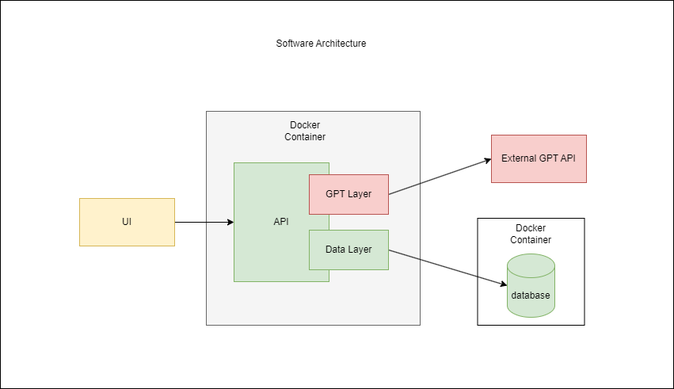

# Ideas

## Tiny
### Create an API with a database
#### MVP
- Create a simple Java API (with CRUD) that talks to a database
- This API needs to be containerized and running against an sql servser db image

#### Nice to have
- Have a gpt layer that talks to an external gpt API of some sort

### Below is a diagram depicting this idea:

